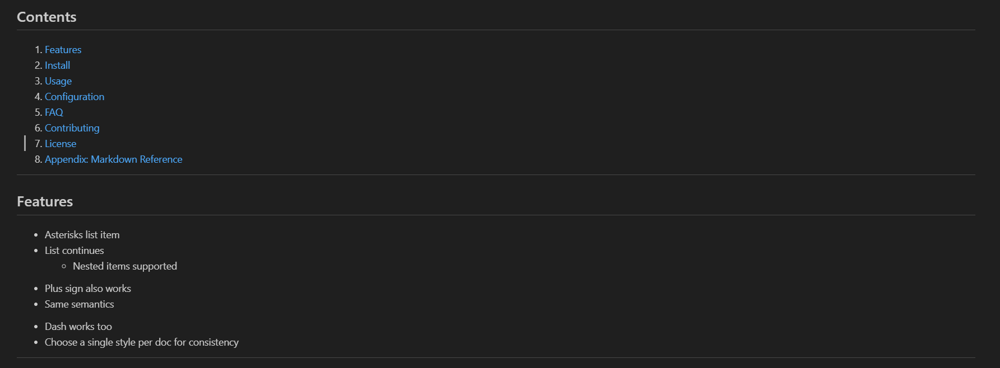
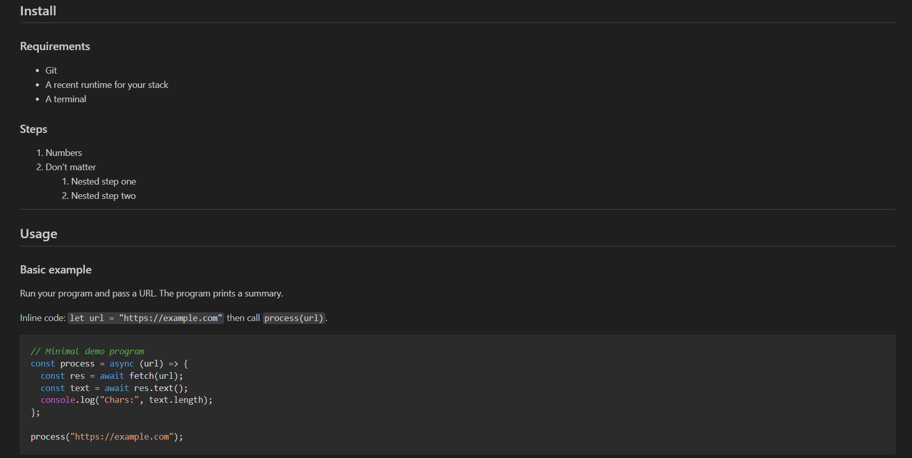
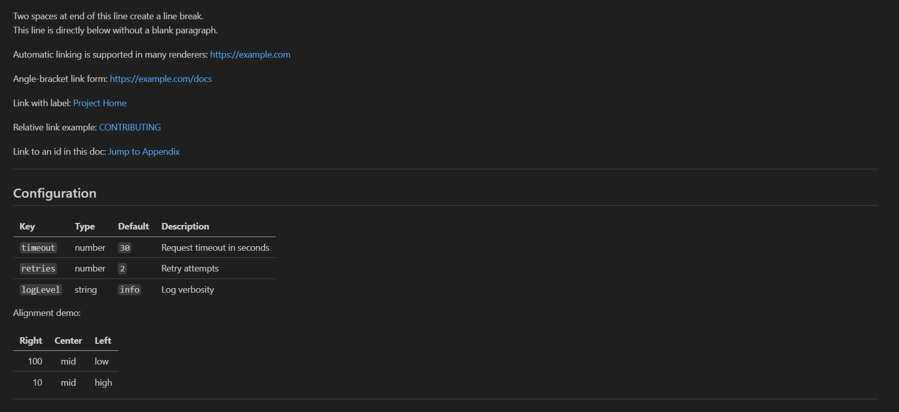
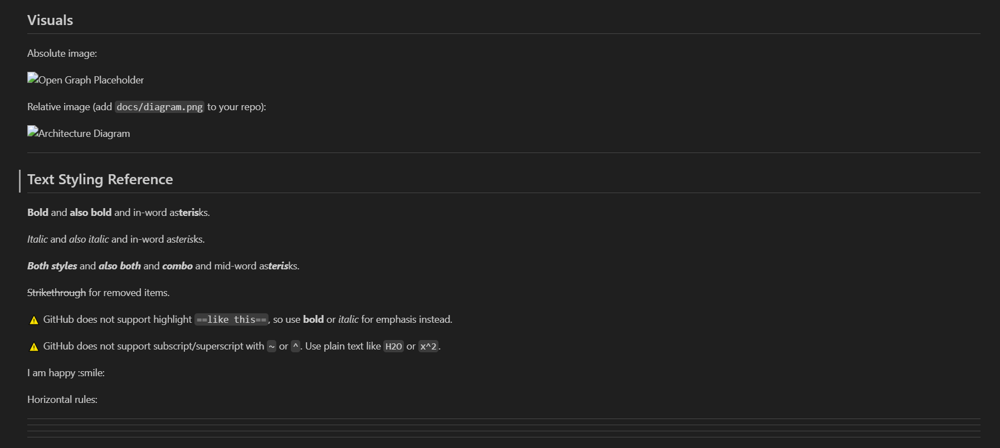
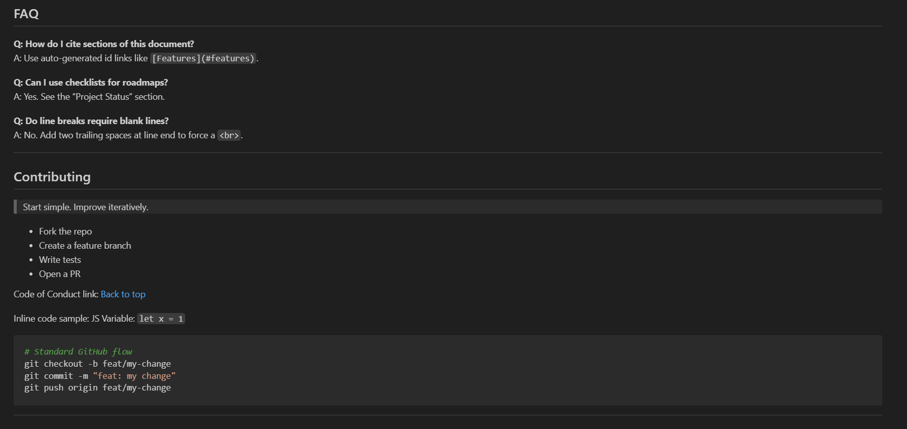
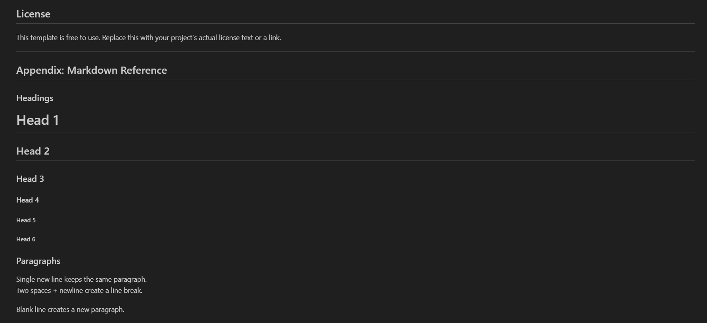

# Learning Markdown 
## Section 1

## My practice file --> [readme_practice.md](https://github.com/akshay-avak/Learning-Markdown/blob/main/readme_practice.md )

**Completed ✅ section 1**

## Section 2
**Completed ✅ section 2**

## Section 3
**Completed ✅ section 3**

## Section 4
**Completed ✅ section 4**

## Section 5
**Completed ✅ section 5**
  

## Section 6
**Completed ✅ section 6**

## Section 7
**Completed ✅ section 7**
